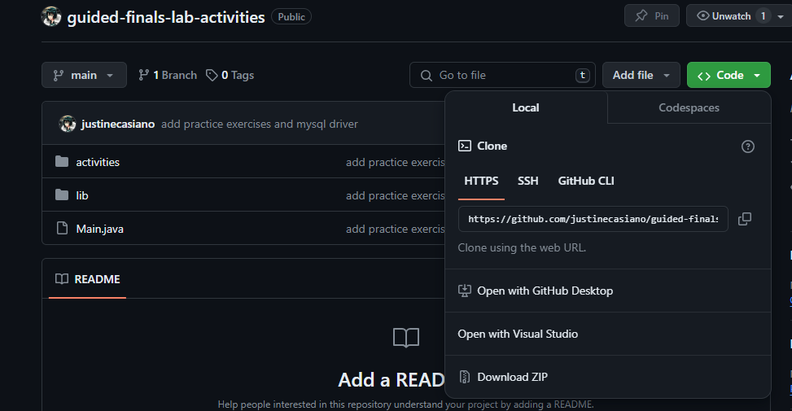
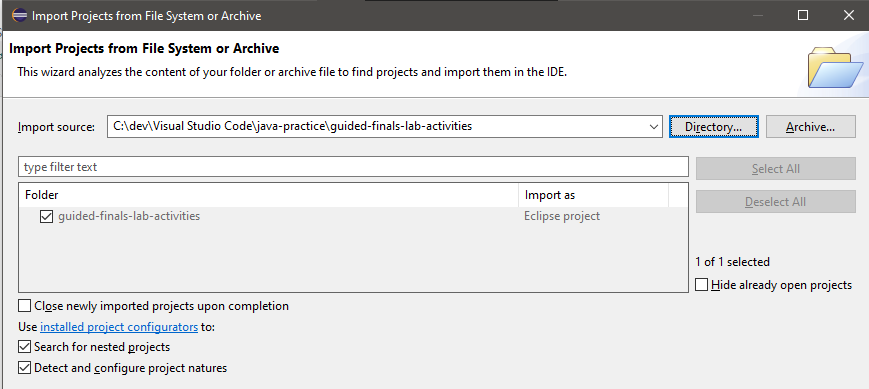
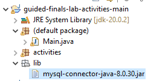
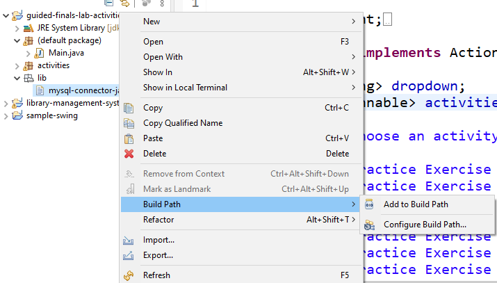
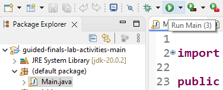

# Guided Finals Lab Activities

> Ready to run and MySQL driver is already included

- This version uses MariaDB instead of MySQL.

## How to run activities?

> You can do it in two (2) ways.

### The `java` Command

1. Go to `/activities`
2. Run each activity using the command: `java FileName.java`

### Use Eclipse

1. Download the code as zip, then unzip the folder
   

2. Make sure [you have Eclipse installed](https://www.eclipse.org/downloads/download.php?file=/oomph/epp/2024-03/R/eclipse-inst-jre-win64.exe), then go to File > Open Projects From File System and then add the directory/folder
   

3. Once added, go to lib package/folder \
   

4. Right-click then go to Build Path > Add to Build Path
   

5. Lastly, select the Main.java File and then run, you could also select the specific Activity.java file and hit run \
   
